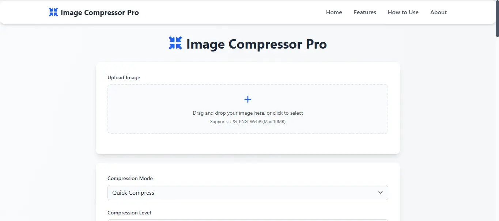
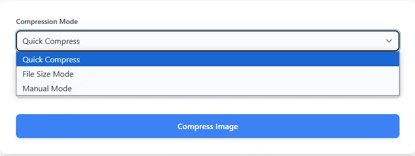
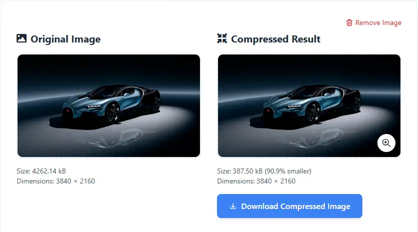
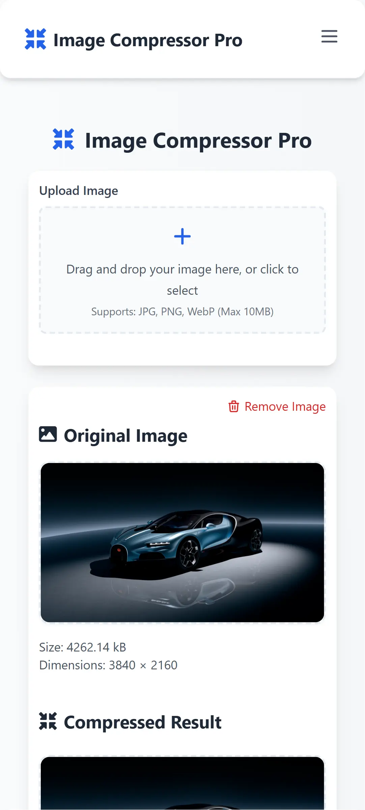

# Image Compressor Pro


Image Compressor Pro is a powerful, browser-based image compression tool that allows users to compress and optimize images without compromising quality. All processing happens locally in your browser, ensuring complete privacy and security of your images.

## Screenshots

### Main Interface

*The main interface showing the upload section and compression controls*

### Compression Modes

*Different compression modes available: Quick, File Size, and Manual*

### Image Comparison

*Side-by-side comparison of original and compressed images*

### Mobile View

*Responsive design working on mobile devices*

## Features

- **Fast Compression**: Quickly compress images in seconds right in your browser
- **Privacy First**: All processing happens locally - your images never leave your device
- **Multiple Compression Modes**:
  - Quick Compress: Simple compression with preset quality levels
  - File Size Mode: Target specific file sizes (20KB to 10MB)
  - Manual Mode: Control exact dimensions while compressing
- **Mobile Friendly**: Fully responsive design works on all devices
- **Format Support**: Compatible with JPG, PNG, and WebP images
- **Real-time Preview**: Compare original and compressed images side by side
- **Zoom Functionality**: Examine compressed images in detail with zoom controls

## Technical Specifications

- Supports JPG, PNG, and WebP image formats
- Compression targets from 20KB to 10MB
- Size reduction up to 80% while maintaining quality
- Precise file size control within 5% of target
- Compatible with all modern web browsers
- Maximum input file size: 10MB

## Use Cases

### Perfect for:
- Web Developers optimizing images for faster page loads
- Digital Photographers reducing high-resolution photos
- E-commerce Owners optimizing product images
- Content Creators meeting platform-specific requirements
- Social Media Managers handling platform size limits

## How to Use

1. **Upload Image**
   - Drag and drop an image file or click to select from your device
   - Supports JPG, PNG, and WebP formats up to 10MB

2. **Choose Compression Settings**
   - Quick Compress: Choose from Low, Medium, or High compression
   - File Size Mode: Select or enter a target file size
   - Manual Mode: Specify custom dimensions

3. **Compress and Download**
   - Click "Compress Image" to process
   - Preview the result and compare with original
   - Download the compressed image

## Common Compression Targets

### Social Media
- WhatsApp images: under 50KB
- Facebook cover photos: under 100KB
- Instagram posts: under 1MB
- Twitter profile pictures: under 50KB

### Web Optimization
- Thumbnail images: under 20KB
- Banner images: under 50KB
- Product photos: under 100KB
- Background images: under 200KB

## Installation

1. Clone the repository:
```bash
git clone https://github.com/yourusername/image-compressor-pro.git
```

2. Open `index.html` in a modern web browser

No additional installation or server setup required - the application runs entirely in the browser.

## Technologies Used

- HTML5
- CSS3 (with Tailwind CSS)
- JavaScript (Vanilla)
- Font Awesome Icons
- Modern Browser APIs for image processing

## Browser Support

Supports all modern browsers including:
- Chrome (latest)
- Firefox (latest)
- Safari (latest)
- Edge (latest)

## Contributing

Contributions are welcome! Please feel free to submit a Pull Request.

## License

This project is open source and available under the [MIT License](LICENSE).

## Author

Created by [Aaditya Kumar](https://github.com/AadityaGeek/)

## Contact

- LinkedIn: [Aaditya Kumar](https://www.linkedin.com/in/aadityakr/)
- Email: work.aadityakumar@gmail.com
- Portfolio: [https://aadityageek.github.io/](https://aadityageek.github.io/)

---

Made with ❤️ by Aaditya Kumar